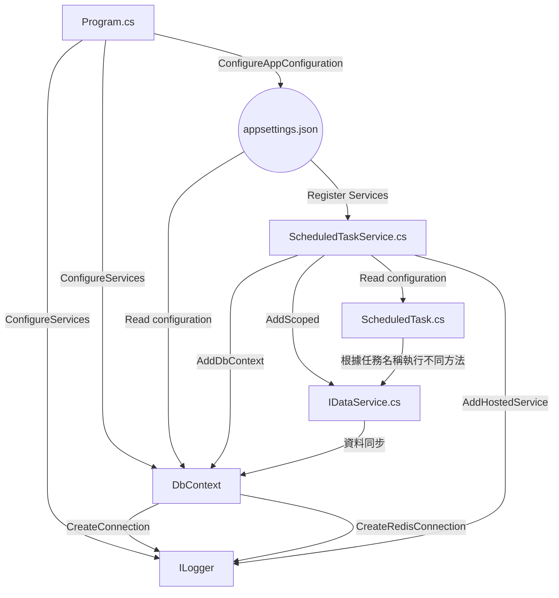

# RedisToMSSQL

## Name
Net7 Console

## Description
<h3>此應用程式的目的是定期執行特定的任務，將 Redis 中的資料寫入到 MSSQL 資料庫中，以確保資料的同步和一致性。使用依賴注入、定時任務服務、Dapper等技術，並使用 JSON 配置檔案來設定在Dev、Beta、Prod的應用程式的參數。</h3>  

Program.cs：這是應用程式的入口點。它建立一個主機，設定應用程式的配置，並執行定時任務服務。

ScheduledTaskService.cs：這個類別實現了 IHostedService 和 IDisposable 介面，用於定義定時任務的服務。在應用程式開始時，它會初始化並註冊需要定時執行的任務，然後啟動計時器以定期觸發這些任務的執行。在應用程式停止時，它會停止計時器。

ScheduledTask.cs：這是定時任務的基本抽象類別，實現了 IScheduledTask 介面。它包含一個建構子，用於接收特定任務的相關資訊。在 ExecuteAsync 方法中，它根據 _name 屬性的值，執行不同的任務，例如 HTelBinding 或 HProp。

DataService.cs：這個類別實現了 IDataService 介面，並用於處理資料同步的相關工作。具體來說，它包含 HTelBinding 和 HProp 兩個方法，分別用於將 Redis 中的 HTelBinding 和 HProp 資料同步到 MSSQL 資料庫中。

DataContext.cs：這個類別繼承自 DbContext，並用於建立與 MSSQL 資料庫和 Redis 的連線。它包含方法來建立 MSSQL 資料庫連線的 SqlConnection 物件，以及建立 Redis 連線的 ConnectionMultiplexer 物件。

appsettings.json：這是應用程式的配置檔案，用於設定應用程式的相關參數，例如連線字串、任務設定、時區、語言等。

<h3>Design Pattern：</h3>  

依賴注入 (Dependency Injection)：程式碼中的許多類別（例如 DataService、ScheduledTaskService 等）都使用依賴注入來解決相依性。這使得類別之間的相互依賴被解耦，增加了代碼的可測試性和可擴展性。

工廠模式 (Factory Pattern)：CreateHostBuilder 方法可以被視為是一個工廠方法，用於創建主機和配置應用程式。

觀察者模式 (Observer Pattern)：ScheduledTaskService 類別實現了 IHostedService，它是一個觀察者模式的實現，當主機啟動時，ScheduledTaskService 作為一個觀察者被通知，開始觀察定時任務的執行。

策略模式 (Strategy Pattern)：在 ScheduledTask 類別中，根據 _name 屬性的值，選擇執行不同的策略（方法）。這是策略模式的一個簡單應用，它允許根據不同的任務名稱執行不同的任務。

資料庫上下文模式 (Database Context Pattern)：DataContext 類別是資料庫上下文，繼承自 DbContext，它負責建立與 MSSQL 資料庫和 Redis 的連線，並提供資料庫操作的功能。

以實現松耦合、可測試和可擴展的架構，藉此提供結構清晰、易於維護的應用程式設計風格。

<h3>運作流程如下：</h3>  

在 Program.cs 中創建主機，設定應用程式的配置。

在 ScheduledTaskService.cs 中初始化並註冊需要定時執行的任務，並啟動計時器。

ScheduledTaskService.cs 在計時器觸發時，進行任務的執行。

在 ScheduledTask.cs 中，根據 _name 屬性的值，選擇執行不同的任務。

在 DataService.cs 中，根據 HTelBinding 或 HProp 方法，將 Redis 中的資料同步到 MSSQL 資料庫中。

DataContext.cs 用於建立與 MSSQL 資料庫和 Redis 的連線，提供必要的資源。

appsettings.json 中配置了應用程式的相關參數，例如連線字串、時區、語言等。

## Badges
On some READMEs, you may see small images that convey metadata, such as whether or not all the tests are passing for the project. You can use Shields to add some to your README. Many services also have instructions for adding a badge.

## Visuals
Depending on what you are making, it can be a good idea to include screenshots or even a video (you'll frequently see GIFs rather than actual videos). Tools like ttygif can help, but check out Asciinema for a more sophisticated method.

## Installation
Within a particular ecosystem, there may be a common way of installing things, such as using Yarn, NuGet, or Homebrew. However, consider the possibility that whoever is reading your README is a novice and would like more guidance. Listing specific steps helps remove ambiguity and gets people to using your project as quickly as possible. If it only runs in a specific context like a particular programming language version or operating system or has dependencies that have to be installed manually, also add a Requirements subsection.

## Usage
Use examples liberally, and show the expected output if you can. It's helpful to have inline the smallest example of usage that you can demonstrate, while providing links to more sophisticated examples if they are too long to reasonably include in the README.

## Support
Tell people where they can go to for help. It can be any combination of an issue tracker, a chat room, an email address, etc.

## Roadmap
If you have ideas for releases in the future, it is a good idea to list them in the README.

## Contributing
State if you are open to contributions and what your requirements are for accepting them.

For people who want to make changes to your project, it's helpful to have some documentation on how to get started. Perhaps there is a script that they should run or some environment variables that they need to set. Make these steps explicit. These instructions could also be useful to your future self.

You can also document commands to lint the code or run tests. These steps help to ensure high code quality and reduce the likelihood that the changes inadvertently break something. Having instructions for running tests is especially helpful if it requires external setup, such as starting a Selenium server for testing in a browser.

## Authors and acknowledgment
Show your appreciation to those who have contributed to the project.

## License
For open source projects, say how it is licensed.

## Project status
If you have run out of energy or time for your project, put a note at the top of the README saying that development has slowed down or stopped completely. Someone may choose to fork your project or volunteer to step in as a maintainer or owner, allowing your project to keep going. You can also make an explicit request for maintainers.
